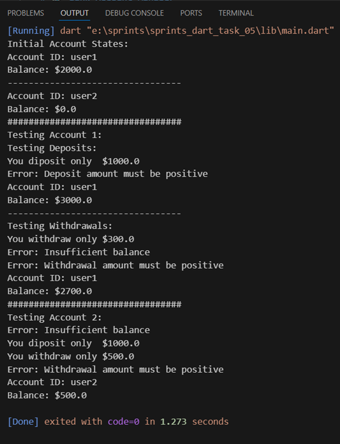

# 🏦 Bank Account Manager

A Dart program implementing a BankAccount class with basic banking operations like deposit and withdrawal.

## 📝 Description

This program demonstrates Object-Oriented Programming in Dart by creating a BankAccount class that:
- Manages account information and balance
- Handles deposits and withdrawals
- Validates transactions
- Displays account information

## 📋 Sample Output

 
